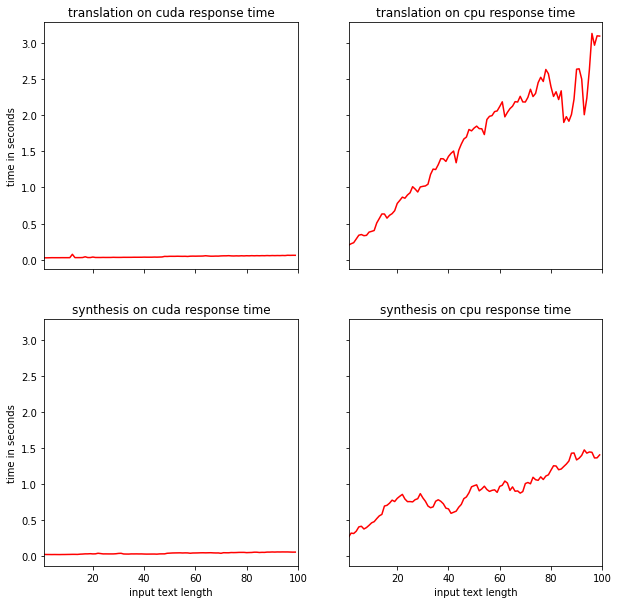

# Translator_for_message_exchange

## Web-application

- application based on [Flask](https://flask.palletsprojects.com/en/2.0.x/)
- hosting [pythonanywhere](https://www.pythonanywhere.com/)
- database [SQLite](https://www.sqlite.org/index.html)
- front-end toolkit [getbootstrap](https://getbootstrap.com/)

## API

Framework is [Fastapi](https://fastapi.tiangolo.com/)

### Docs

Generated by swagger [here](https://editor.swagger.io/?url=https://raw.githubusercontent.com/BlessedTatonka/Translator_for_message_exchange/main/src/openapi.yaml)

### Models

- english to russian translator model [NMT En Ru Transformer6x6](https://catalog.ngc.nvidia.com/orgs/nvidia/teams/nemo/models/nmt_en_ru_transformer6x6)
- russian to english translator model [NMT Ru En Transformer6x6](https://catalog.ngc.nvidia.com/orgs/nvidia/teams/nemo/models/nmt_ru_en_transformer6x6)

speech synthesis
> - vocoder model [TTS En FastPitch](https://catalog.ngc.nvidia.com/orgs/nvidia/teams/nemo/models/tts_en_fastpitch)
> - spectrogram generator model [TTS Vocoder Hifigan](https://catalog.ngc.nvidia.com/orgs/nvidia/teams/nemo/models/tts_hifigan)

#### Execution time  

#### Weights

| Model                   | Weight      |
| :---                    | ----------- |
| nmt_transformer6x6      | 861.05 MB       |
| fastpitch               | 162.07 MB        |
| hifigan                 | 300.78 MB        |

